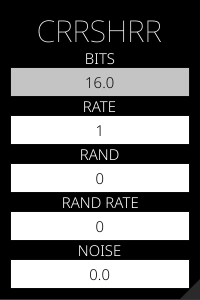

# crrshrr

**crrshrr** is a simple bit crusher effect. It is available as a VST and CLAP plugin for Windows and Linux, and can be compiled to Windows, Linux and OSX. 



While the bit depth and (sample) rate parameters do what may be expected to, the random and random rate parameters add a bit of a distinctive flavor to it.  

This was created as a way to play around with Rust, nih-plugs, and just audio effects in general. 

## Building

After installing [Rust](https://rustup.rs/), you can compile crrshrr as follows:

```shell
cargo xtask bundle crrshrr --release
```
